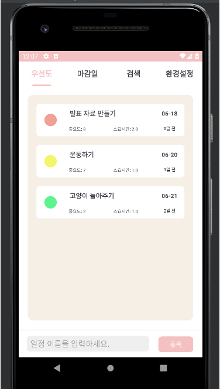
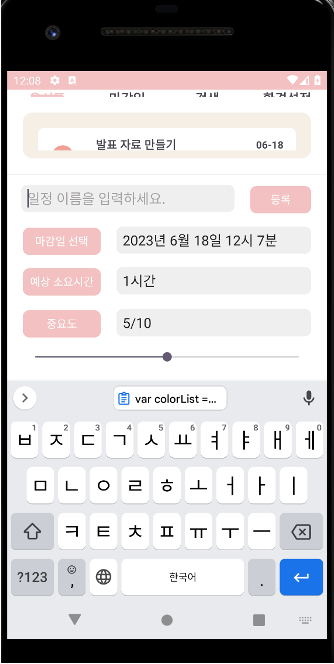
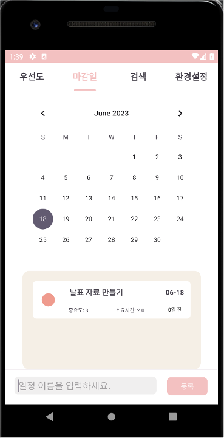
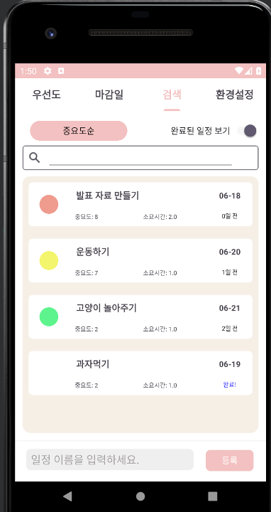

# What-to-do

📆 2023. 05. 11. ~ 2023. 06. 21.

 

## 📱 Screenshots

||||||
|:-:|:-:|:-:|:-:|:-:|
|PriorityView|Make To do|CalendarView|SearchView|SettingView|

 

## 🧑🏻‍💻 Members

<!-- |Developer|Developer|Designer|Developer| -->
|||||
|:-:|:-:|:-:|:-:|
|[권민규](https://github.com/MingyuKwon)|[서한솔](https://github.com/hkseo98)|[문종식](https://github.com/moonjs0113)|[한범진](https://github.com/Detectheif)|

 

## Description

- 시중 출시된 있는 일정 앱들은 종이 다이어리와 별반 차이가 없습니다. 마감 기한을 알려주고 알림을 보내주는 것이 거의 전부입니다. 
- What To Do는 할 일이 여러 개가 있을 때 무엇을 해야할지 정해주는 앱이 있다면 좋지 않을까? 하는 생각에서 출발했습니다. 
- What To Do는 사용자에게 입력 받은 마감 기한, 예상 소요시간, 중요도 정보와, 사용자 설정 정보를 통해서 여러가지 일 중에서 **지금 당장 해야하는 일이 무엇인지 알려주는 앱 서비스**입니다. 

 

## 🛠 Developement Environment

|Environment|Version|
|:-:|:-:|
|Kotlin|1.8.0|
|Android Studio|Jellyfish|
|TargetSDK|Android 13 (API level 33)|

 

## 📚 Tech Stacks

- room
- fragment
